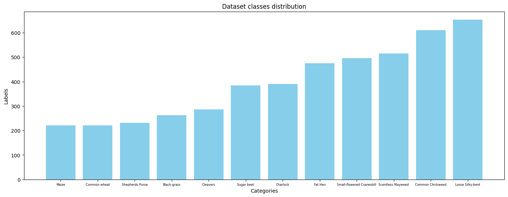
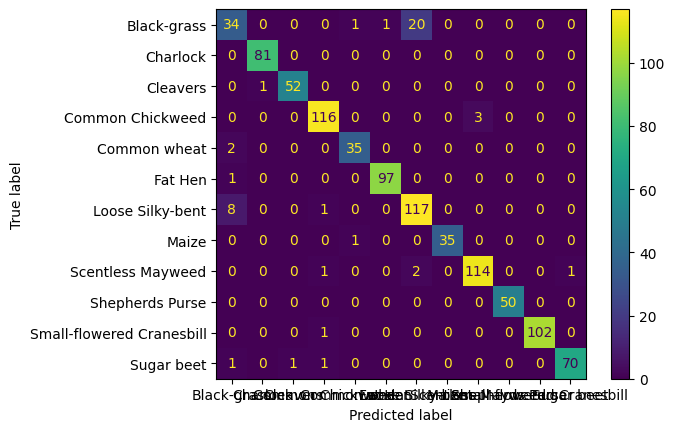
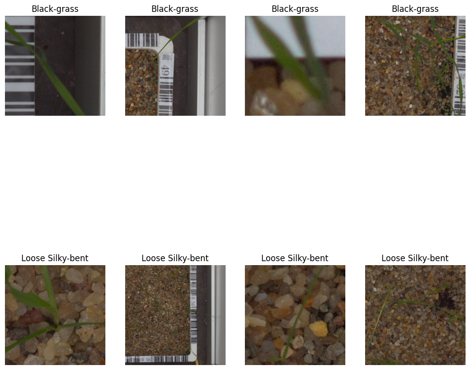
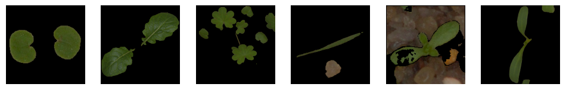

# Vision Transformer for multiclass Plant Seedlings Classification

## Summary
This work consists in a dataset preparation, training, and evaluation of an image classification system based on the vision transformer (ViT) architecture from [An Image is Worth 16x16 Words: Transformers for Image Recognition at Scale](https://arxiv.org/abs/2010.11929) paper. The dataset was extracted from the [Plant Seedlings Classification kaggle](https://www.kaggle.com/c/plant-seedlings-classification) challenge.

During the first part of the task, a classical multilabel classification was applied with no additional preprocessing to the input data. In the second part, a new dataset was constructed using Zero Shot Segmentation in order to get rid of background features and focus the feature extraction only on the plants present in each image.


## Requirements

Install `python 3.9.20` create a virtual env and execute:

```
pip install requirements.txt
```

## Data preparation
The dataset provided by Kaggle has the following structure:
```
plant-seedlings-classification
├── test
└── train
    ├── Black-grass
    ├── Charlock
    ├── Cleavers
    ├── Common Chickweed
    ├── Common wheat
    ├── Fat Hen
    ├── Loose Silky-bent
    ├── Maize
    ├── Scentless Mayweed
    ├── Shepherds Purse
    ├── Small-flowered Cranesbill
    └── Sugar beet
```
> NOTE: The data from the original `test` folder was excluded from the final dataset since it only contains unlabeled images.

The dataset contains 4750 images distributed accross 12 categories: 



For simplicity the dataset was restructured moving all images in a single folder and keeping a `.csv` file with image names and classes:

```
6a4ef17c2.png,Cleavers
0515bc601.png,Cleavers
0ac327873.png,Cleavers
...
```

In order to achieve this we have `create_dataset.py` script:

```python
python ./utils/create_dataset.py -d KAGGLE_TRAIN_DATASET_PATH -c OUTPUT_CSV -of OUTPUT_IMAGES_FOLDER
```
This will generate the csv file mentioned above and will move all the images from the subfolders to a single directory.
> You can also download this dataset from [here](https://drive.google.com/file/d/1CcgEuF7Ayp0yWcqYf0GZeZ729rGwv04o/view?usp=sharing) and extract it into the root of this repository to reproduce all the experiments.


## Stage 1: Model training

According to [An Image is Worth 16x16...](https://arxiv.org/abs/2010.11929) Vision Transformer attains excellent results compared to state-of-the-art convolutional networks while requiring fewer resources to train. That's why the smallest ViT model from the family was selected for this task in order to validate the idea and keep the GPU hours low.

Used models:
    
* vit-tiny-patch16-224

To train a model run:

```sh
python train.py -if DATASET_CSV_FILE -d DATASET_IMAGE_FOLDER -e EXPERIMENT_OUTPUT_FOLDER -t training_cfg.yml
```

Were:

- `-if:` csv file listing all images and classes generated in the previous steps
- `-d:` Folder containing all the images from the dataset
- `-e:` Output Folder to store the experiment assets, trained model and metada.
- `-t`: Training config yaml file.


### Training Configuration

In order to keep the reproducibility in each experiment, a `yaml` file was used to track some of the most important hyperparameters. Most of them are already logged by the `transformers` trainer class into the experiment folder. The LR scheduller (linear decay), optimizer (AdamW) and loss function (Cross Entropy) were used by default.

The default parameters related to data batching and model type are:

```python
class TrainingConfig(BaseModel):
    model_name: str = 'WinKawaks/vit-tiny-patch16-224'
    epochs: int = 30
    batch_size: int = 4
    learning_rate: float = 5e-4
    data_split: Annotated[float, Field(gt=0, lt=1)]
```

Random horizontal and vertical flips were applied for data augmentation.

### Results

The final results for `vit-tiny-patch16-224`:
```
accuracy: 0.95
average precission: 0.95
average f1: 0.95
average recall: 0.94
```
Bellow you can find the evaluation metrics per each class:

Confusion matrix

 

Classification report

```
                           precision    recall  f1-score   support

              Black-grass       0.74      0.61      0.67        56
                 Charlock       0.99      1.00      0.99        81
                 Cleavers       0.98      0.98      0.98        53
         Common Chickweed       0.97      0.97      0.97       119
             Common wheat       0.95      0.95      0.95        37
                  Fat Hen       0.99      0.99      0.99        98
         Loose Silky-bent       0.84      0.93      0.88       126
                    Maize       1.00      0.97      0.99        36
        Scentless Mayweed       0.97      0.97      0.97       118
          Shepherds Purse       1.00      1.00      1.00        50
Small-flowered Cranesbill       1.00      0.99      1.00       103
               Sugar beet       0.99      0.96      0.97        73
```

You can notice a strong confusion pattern between Black-grass and Loose Silky-bent. If we inspect how those classes look you will be surprised in how similar they are. It's hard to distinguish one from another, even for a trained human!



This model checkpoint can be downloaded from [HERE](https://drive.google.com/drive/folders/1iJdjsijN_W1W5Yf0Nln37CDafvqO5Du_?usp=sharing)

A wrapper class `GrassClassificationModel`, prepared for inference with this model can be found in `classification_models.py`.

## Stage 2: Zero Shot Segmentation Preprocessing

In this stage the idea was to preprocess the input images to get rid of background features and focus the feature extraction only on the plants present in each image (foreground).


Two approaches were considered, first the recently released SAM2 segmentator, but it turns to be too slow (even using a GPU) and it tended to oversegment the images so a lot of different heuristics for each grass type had to be defined to clean up the SAM2 output masks. 

The second aproach, and the one I selected, was using a smaller model from the same family: `FastSAM` in combination with a Zero Shot detector: `GroundingDINO`.
GroundingDINO is a zero shot detector and it was used to select ROIs (regions of iterest) in each image with grass seeblings on it. Those ROIs, marked with bboxes were passed as a prompt to FastSAM to generate the desired segmentation mask isolating grass pixels from the background.

Some examples of the preprocessed dataset:


> Note: The masked images are included into the main dataset under the `/masked` directory.

As you can see some of the images are segmented very well, but others present some artifacts that will impact the classification accuracy. This is because of image resolution,  in images of better quality this segmentation approach worked very well but if the resolution is too low or the grass is too thin it didnt segment very well.

The script for this task can be found in `utils/create_masks.py`

### Results

The ViT model was trained with exactly the same parameters as in the previous stage but using this new dataset. The results are bellow:

```
accuracy: 0.90
average precission: 0.89
average f1: 0.88
average recall: 0.88
```


```
                           precision    recall  f1-score   support

              Black-grass       0.72      0.52      0.60        56
                 Charlock       0.96      0.98      0.97        81
                 Cleavers       0.91      0.96      0.94        53
         Common Chickweed       0.92      0.96      0.94       119
             Common wheat       0.78      0.76      0.77        37
                  Fat Hen       0.94      0.91      0.92        98
         Loose Silky-bent       0.76      0.90      0.82       126
                    Maize       0.95      0.97      0.96        36
        Scentless Mayweed       1.00      0.92      0.96       118
          Shepherds Purse       0.83      0.80      0.82        50
Small-flowered Cranesbill       0.98      0.98      0.98       103
               Sugar beet       0.93      0.92      0.92        73
```

This model checkpoint can be downloaded from [HERE](https://drive.google.com/drive/folders/1KWQlf_OHUw3HEOjhcPQckrSlGwoY-XvU?usp=sharing)

We can see how all metrics decrease with respect of the original results because of the segmentation artifacts present in some of the images. Also, the same confusion pattern between Black-grass and Loose Silky-bent is still present. Thos classes are too similar and also are really hard to segment since the grass shape is thin.

In my opinion the original model is good enough, using a Zero Shot Segmentation preprocessing didnt worth the computing costs and code overhead for this case.

## The extra mile

### Dataset inconsistencies

According the distribution shown in the data preparation section we have some imbalance in the dataset (a lot of Scentless Mayweed, Small-flowered Cranesbill, Loose Silky-bent and Common Chickweed) . A tipical approach would be downsample those classes in order to re balance the training set but despite that issue the results were pretty good.

### What the models are taking into account?

Here is a very interesting work about what actually the transformers learn: [What do Vision Transformers Learn? A Visual Exploration](https://arxiv.org/abs/2212.06727). According to this work ViTs and CNNs behave similarly in the way features progress from abstract patterns in early layers to concrete objects in late layers.


